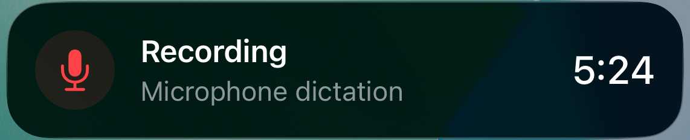
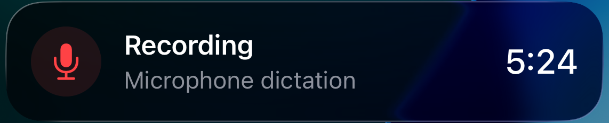
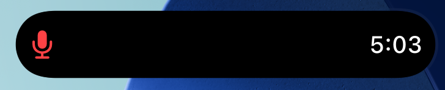

# Native presentation evidence

Captured September 28, 2026 from the isolated `DictationActivityQA` harness on
iOS Simulator 26.5. The harness starts the production controller with an invented
five-minute timestamp. It never accesses a microphone, server, account, or chat.

The controller, activity attributes, and widget in these captures are unchanged
in the v6.2-based change. The screenshots come from the passing light/dark native
UI runs. The video excerpt shows only the advancing timer, not expiry or cleanup.

All images are crops of native system-rendered UI. The silent video is an eight-second
crop of the original screen recording at normal speed. Only the activity itself
is shown; unrelated simulator UI and system notifications are excluded. Image
and video metadata contain no identity or instance information.

These captures demonstrate appearance and system timer rendering. They do not
prove microphone capture on a physically locked phone. A fresh v6.2 simulator
execution was unavailable; the v6.2 lifecycle and background tests ran separately.

[Watch the native elapsed timer](native-timer.mp4)
