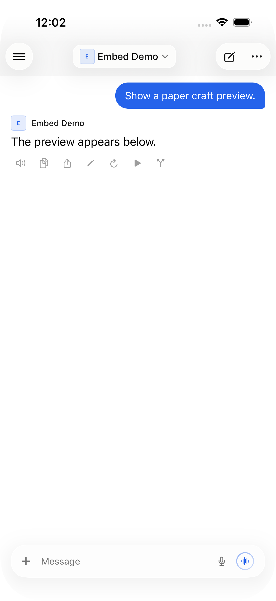
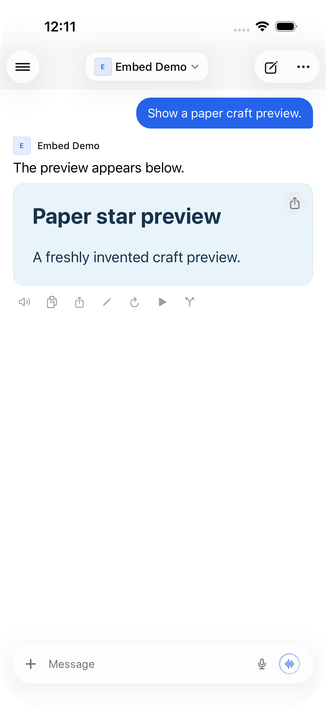

# Native live embeds

Synthetic regression coverage for `embeds` and `chat:message:embeds`. No private instance or conversation is used.

## Focused checks

Run `python3 Tests/LiveEmbeds/run.py`. This compiles the actual message model, history serialization, and event helper with a small chat harness. All 17 checks pass: message equality, Codable compatibility, replacement/clearing, duplicate delivery, invalid payloads, wrong-chat routing, unknown messages, and inactive history branches.

`python3 Tests/LiveEmbeds/run.py --baseline` reproduces the regression against `origin/main`: changing only embeds does not invalidate message equality. The helper is also absent there.

## Simulator reproduction

Install the app, run `fixture.py` with `aiohttp` and `python-socketio`, and connect the app only to `http://127.0.0.1:18191`. The fixture accepts invented credentials and returns a synthetic account. Generate the standalone UI test project with `xcodegen generate --spec Tests/LiveEmbeds/project.yml`, then run its `LiveEmbeds` scheme against the simulator.

- `testBefore`: the native event arrives but no preview appears.
- `testEmbeds`: preview arrival, same-count replacement through the legacy alias, persisted preview after relaunch, clearing, active-generation updates, and updates after completion.

Verified on Open Relay 6.0 baseline `4151a73`, using Open WebUI `8bd8b4f` for the public event contract. The full Release iOS Simulator build and both corresponding before/after UI runs pass on iOS 26.5. The existing HTML renderer is unchanged; this is not a general web-content security or media-playback test.

## Screenshots

| Before | After |
|---|---|
|  |  |

Only these reviewed synthetic screenshots are included. Raw simulator diagnostics and recordings are not publication artifacts.
