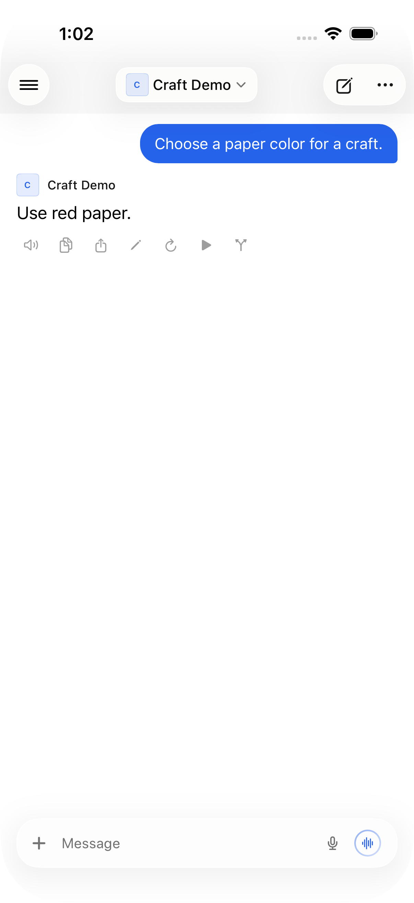
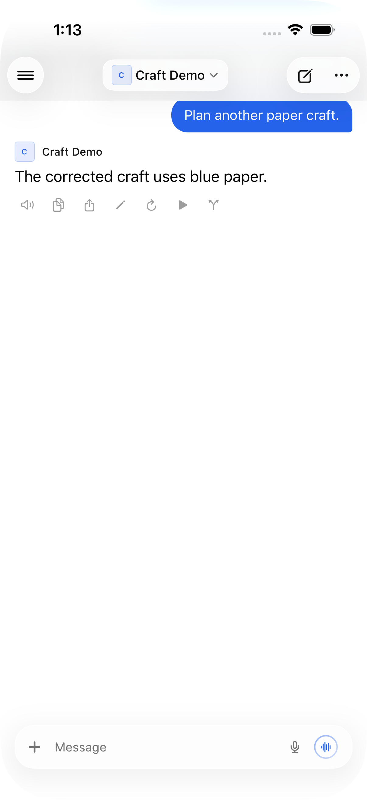

# Native outlet corrections

Synthetic regression coverage for `chat:outlet` text corrections, based on Relay
6.0 (`4151a735`) and the Open WebUI `8bd8b4fa` event/history contract.

## Reproduction

1. Connect a disposable simulator installation to `fixture.py` on loopback port
   18191 using `demo@example.test` and any synthetic password.
2. Open **Synthetic paper colors**. Its saved answer says “Use red paper.”
3. `POST /_test/correct` sends the native outlet event and persists “Use tan
   paper.” with `originalContent`, retaining the old structured output.
4. Before the fix, the visible answer stays red, including after reopening.
   After the fix, it changes to tan and stays tan after reopening.

The fixture has no external provider or private data. Install `aiohttp` and
`python-socketio` in an isolated environment to run it. It binds only to loopback.

## Validation

- `python3 Tests/LiveOutlet/run.py`: **25 checks pass**, compiling actual message,
  history and event-handler code. The event-handler harness stubs its streaming
  store; actual finishing-tail behavior is covered by the simulator test below.
- `python3 Tests/LiveOutlet/run.py --baseline`: **all three regression probes
  fail** against the pinned upstream revision: saved text precedence,
  `originalContent` preservation, and equal-byte-length message equality.
- Full iOS Simulator Release build passed with the installed Xcode 27 SDK.
- Actual iOS 26.5 simulator: `testBefore` reproduces the live and saved failures;
  `testOutlet` passes live replacement, unrelated-chat rejection, reopening,
  completion followed immediately by outlet correction, later correction and
  reopening again. The obsolete typewriter tail does not overwrite the result.
- Focused checks additionally cover empty replacements, malformed payloads,
  duplicate events, inactive branches, ordinary rich-output reconstruction and
  not interrupting a newer continuation of the same message.

Generate the standalone XCUITest project with `xcodegen generate` in this folder.
Run `LiveOutlet` on an already configured synthetic-only simulator. Use an
ad-hoc-signed test runner. Screenshots are captured by XCUITest, not mock renders.

This change applies native **text** corrections; it does not add arbitrary
outlet metadata merging. A live output-only update with unchanged text is not
claimed as supported. It does not change terminal/file attachments or server code.

## Screenshots

All visible content is freshly invented by the fixture. Image metadata was
reviewed; no real chats, instance settings, credentials, logs or test bundles are
included.

| Before: correction ignored | After: correction applied |
| --- | --- |
|  |  |

After a correction arrives while completion animation is draining:

