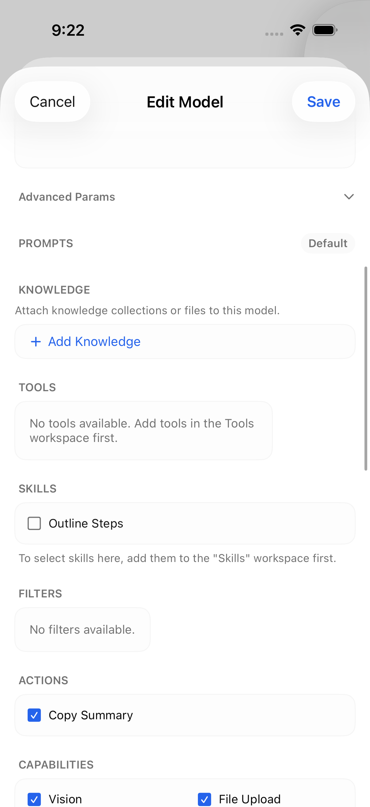
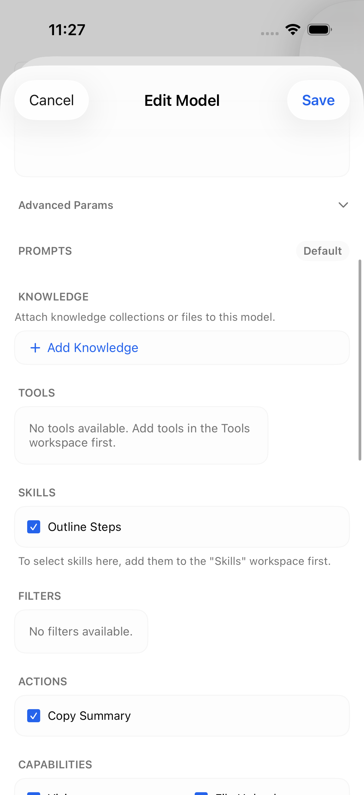

# Model configuration round-trip regression tests

## Focused checks

Run `bash Tests/ModelRoundTrip/run.sh` with Xcode selected. Set `TMPDIR` to
choose where compiler artifacts are written.

The tests compile the production model and its dependencies, with unrelated
channel-message rendering and attachment serialization stubbed. They cover:

- Independent Action and Skill IDs, including removals and skills-only models.
- Parameter preservation during a rename and a second save.
- Preservation of the upstream 6.0 metadata handling, including native TTS and
  capability-aware default features, unknown capabilities/tools, and translations.
- JSON numbers, Booleans, objects, arrays, null, and strings resembling JSON.
- Deliberate removals, new JSON/plain-text parameters, and Boolean-to-number edits.
- The original configuration baseline carried into a rebuilt editor form.

The initial checks reproduced ten failures on the upstream 5.9 model code
(`f5b8ce8`; 9/19 passed). The fixed version passes all 27 checks, including the
additional editor/removal/type-change checks. Existing Swift 5 Sendable warnings
in unrelated models are not suppressed by the runner.

Rebased on 6.0 (`4151a73`): the release already preserves unknown model metadata.
This patch now builds on that implementation rather than replacing it. Remaining
changes separate Actions/Skills and preserve parameter types and unedited values.

## Simulator check

Use only an isolated simulator with the loopback fixture:

1. Run `python3 Tests/ModelRoundTrip/fixture.py`.
2. Generate the standalone test project with `xcodegen generate` from this folder.
3. Install an app build on the simulator and connect to `http://127.0.0.1:18191`.
   The invented login is `demo@example.test`, password `synthetic`.
4. Against the unmodified model editor, run only `ModelEditorUITests/testBefore`.
5. Against the fixed editor, run only `ModelEditorUITests/testSavePreservesConfiguration`.

The test opens the real Workspace editor, captures its selections, saves through
the authenticated client API, and checks the payload received by the fixture.
Both original 5.9-based runs passed on iOS 26.5. No production instance or model
provider is used. Rebased-build visual validation is tracked separately.

| Before: saved skill shown unchecked | After: independent selections restored |
|---|---|
|  |  |

These are actual simulator captures of newly invented settings. The screenshots,
PNG metadata, fixtures, and source diff were reviewed for private information.

This change preserves values unsupported by the editor; it does not add controls
for every server setting. As before, saving a stale editor is not an atomic merge
with concurrent edits from another client.

Custom parameter values are shown as JSON, including quotes around strings. This
makes `"true"` (a string) distinct from `true` (a Boolean). Plain text remains
accepted when the entered value is not JSON.
