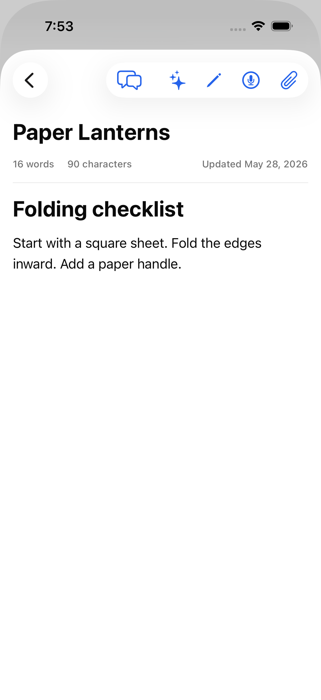
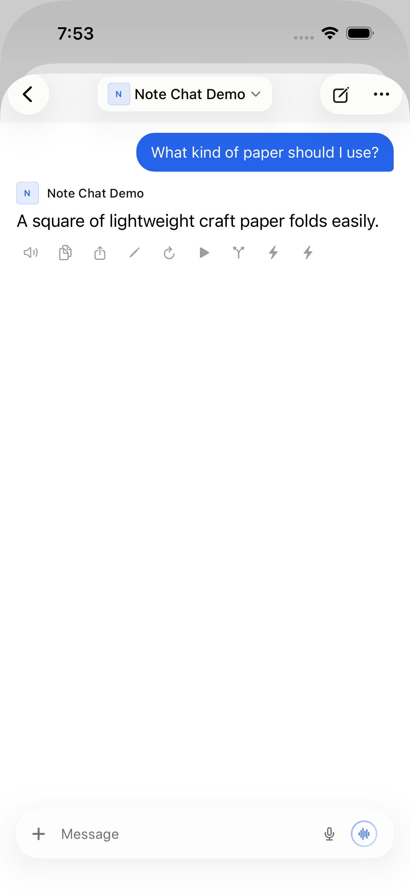
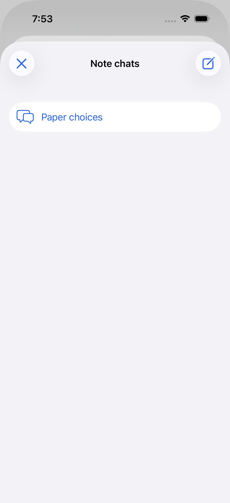
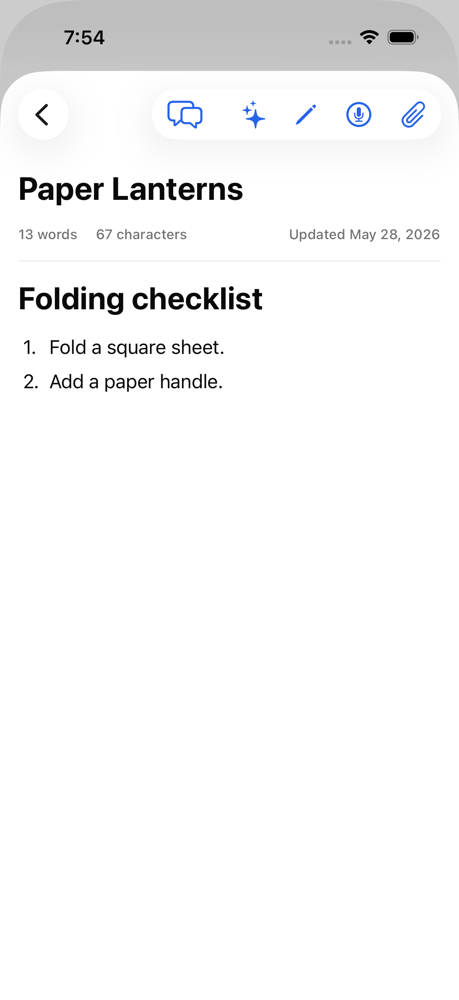
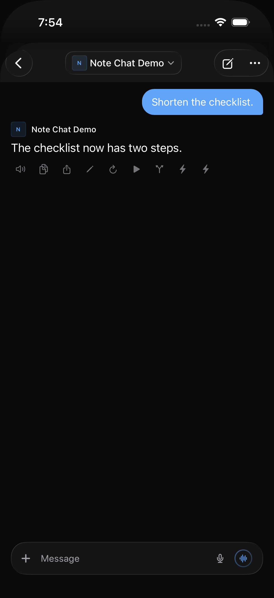
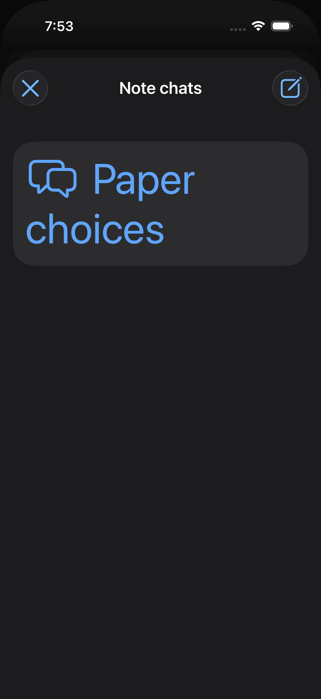
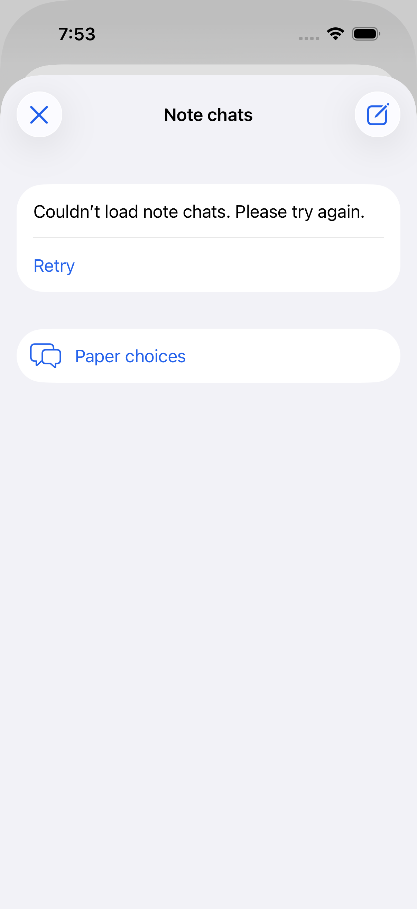

# Native note conversations

Baseline: Open Relay 6.0, `4151a735512d5d6dbc9fd1962fa806517a0d4ea7`.
Contract reviewed against Open WebUI `8bd8b4fac5e059578ac0c74b3c18d11139f88b7d`:
[Notes API](https://github.com/open-webui/open-webui/blob/8bd8b4fac5e059578ac0c74b3c18d11139f88b7d/backend/open_webui/routers/notes.py)
and [note editor](https://github.com/open-webui/open-webui/blob/8bd8b4fac5e059578ac0c74b3c18d11139f88b7d/src/lib/components/notes/NoteEditor.svelte).

The editor previously offered title generation and enhancement, but no way to
open the note's native hidden conversations. The new Chat action opens that
conversation using the existing chat renderer and composer. Its back button
opens history; New Chat keeps a separate draft and creates a hidden server chat
only when the first message is sent. The server-provided `params.system` is
preserved, not recreated by the client. Server-side tools and permissions still
control whether a model can edit the note.

The native GET `/notes/{id}/chat` is **get-or-create**, and GET `/notes/{id}/chats`
can normalize stored parameters. Neither is used as passive prefetch or retried
automatically. Merely opening the note does not request either endpoint.
Unsaved server/client text differences block chat creation. A failed first send
retains its text for manual retry. Account/token changes reject stale results.

Hidden ordinary chats must not also handle links or text-selection actions from
the embedded chat. A synthetic link regression in the initial implementation
produced two authenticated file downloads for one tap; the visibility guard
limits handling to the visible conversation. Share-extension and new-chat deep
links remain ordinary-chat actions, not note-chat actions.

## Focused checks

Run `sh Tests/NoteChats/run.sh` from the repository root. This compiles the actual
session and Note model against small transport/Conversation-decoder doubles.
The 29 checks verify endpoint/method selection, no automatic retries, single-flight
creation, cancellation, malformed responses, unsaved-note checks, and account
identity. It does not stand in for the real Conversation decoder or UI.

## Full-app fixture

1. Use an isolated simulator with no personal accounts or data. Build/install the
   app normally. Install `aiohttp` and `python-socketio` in a disposable environment.
2. Run `python Tests/NoteChats/fixture.py`. It binds only to `127.0.0.1:18191`,
   never forwards traffic, and uses invented text and a synthetic token.
3. Sign in to `http://127.0.0.1:18191` with invented values. Generate the test
   project with `cd Tests/NoteChats && xcodegen generate`.
4. Run the `NoteChats` scheme with an explicit simulator and external build path:

```sh
xcodebuild -project Tests/NoteChats/NoteChats.xcodeproj -scheme NoteChats \
  -destination 'platform=iOS Simulator,id=SIMULATOR_ID' \
  -derivedDataPath /path/to/build-output \
  -resultBundlePath /path/to/results.xcresult \
  -parallel-testing-enabled NO -collect-test-diagnostics never \
  -skip-testing:NoteChatsUITests/NoteChatsUITests/testBefore test
```

Run `testBefore` separately on a build without the feature. Screenshots come
from the actual application, not UI mockups. Never commit result bundles, raw
logs, simulator data, or credentials.

The fixture persists hidden chat history, checks the authenticated native
context in completion requests, and emits real Socket.IO completion events.
Its two-step note edit is a simulation, not a live model/provider/tool benchmark.
Ordinary `/chats/new` creation is rejected to catch incorrect routing.

The seven UI checks cover saved-chat opening, independent ordinary/note drafts,
delayed first-send creation, failed creation/retry, history failure/retry, stale
note content, reopening in dark mode, largest accessibility text, link routing,
new-chat deep links, and completion after closing the panel. A late completion
must refresh the preview without replacing text in the active note editor.
Actual server-tool availability, model compliance, concurrent multi-user edits,
and iPad-specific layout remain separate from these synthetic checks.

Verified on iOS 26.5: all seven full-app tests and all 29 focused checks pass.
The Release simulator app build passes. The separate baseline UI test confirms
the missing Chat action before the change. No real provider was contacted.

The comparison uses an actual 6.0-based app without linked chats for the before
capture. Its existing note attachment change has no visible effect on this
attachment-free fixture. The after captures use this branch's Release build.
The baseline has no Chat action; the new action, saved conversation, history,
updated note, and dark-mode reopening are captured directly in the simulator.

## Screenshots

All content below is from the invented fixture, not a personal library.

| Before: editor | After: Chat action |
| --- | --- |
|  |  |

| Saved conversation | Note chat history |
| --- | --- |
|  |  |

| Updated note | Reopened in dark mode |
| --- | --- |
|  |  |

| Largest accessibility text | History retry |
| --- | --- |
|  |  |
