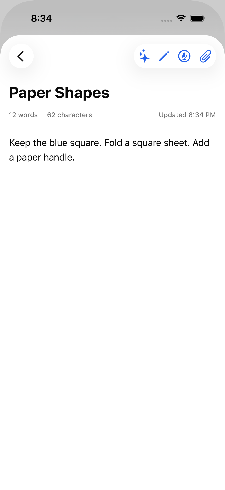
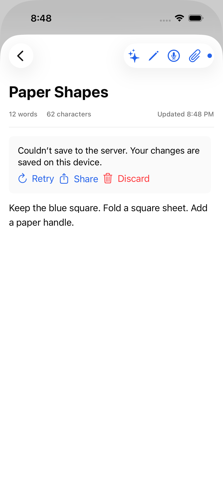
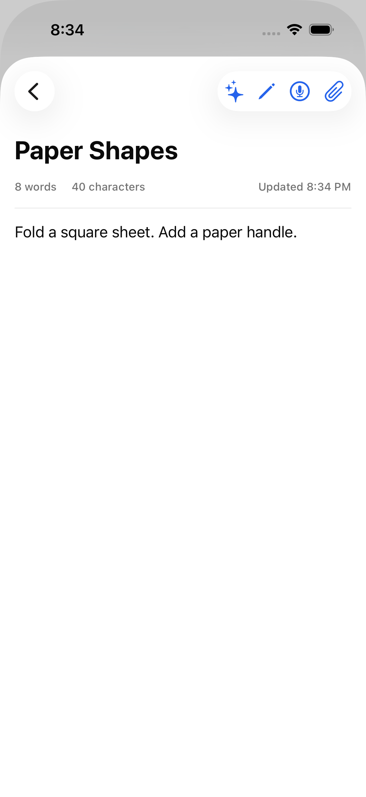
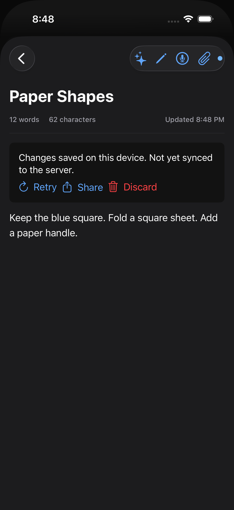

# Recover unsynced note edits

Baseline Notes implementation: Open Relay 6.0, `4151a735`.

The existing editor caches an edit before trying its server update. A later list
refresh replaces that cache with the server response, losing a failed edit. The
standalone baseline test compiles the original NotesManager and reproduces this
loss with invented text and a failed mocked request.

Recovery keeps unsynced title/body edits in Application Support, separate from
the replaceable cache, scoped by server and account. A recovered or failed edit
waits for manual Retry. Retry reads the server first and refuses to overwrite a
changed field; an already-saved response is reconciled without another write.
Successful saves remove only the acknowledged revision. New typing during a
request remains pending. Sharing does not discard the saved copy; discard is an
explicit confirmed action. No recording, chat, account, or real server data is
used by these tests.

## Focused tests

From the repository root, with a disposable output directory:

```sh
TMPDIR=/path/to/test-output sh Tests/NoteDrafts/run.sh
```

This compiles the actual store, save coordinator, note model, and list view
model with small transport/cache doubles. It checks disk persistence, account
isolation, failed requests and explicit retry, rich-content preservation on
rename, conflicts, lost success responses, new typing during saves, duplicate
requests, cancellation, late responses, refresh/search integration, protected
deletion, corrupt files, and disk errors.

To reproduce the original cache loss separately:

```sh
swiftc -swift-version 5 -parse-as-library \
  'Open UI/Core/Models/Note.swift' 'Open UI/Core/Services/NotesManager.swift' \
  Tests/NoteDrafts/Baseline.swift -o /path/to/test-output/baseline
/path/to/test-output/baseline
```

The baseline executable has its own UserDefaults domain and never runs inside
the real app. It seeds and removes only its invented note value.

## Full-app UI reproduction

Use an isolated simulator signed in only to the loopback fixture:

```sh
python3 -m venv /path/to/test-output/venv
/path/to/test-output/venv/bin/pip install aiohttp python-socketio
/path/to/test-output/venv/bin/python Tests/NoteDrafts/fixture.py
```

The fixture accepts invented login values at `http://127.0.0.1:18191`. It never
forwards requests. Build/install the actual app, then generate the UI project:

```sh
cd Tests/NoteDrafts
xcodegen generate
xcodebuild -project NoteDrafts.xcodeproj -scheme NoteDrafts \
  -destination 'platform=iOS Simulator,id=SIMULATOR_ID' \
  -derivedDataPath /path/to/test-output/ui \
  -resultBundlePath /path/to/test-output/results.xcresult \
  -parallel-testing-enabled NO -collect-test-diagnostics never \
  -skip-testing:NoteDraftsUITests/NoteDraftsUITests/testBefore test
```

Run only `testBefore` against the baseline app. It expects the edit to disappear
after a failed save and reopening. The changed-app cases cover recovery through
navigation/relaunch, explicit retry without automatic resubmission, server
conflicts, native sharing and cancelled discard, formatting edits, edits during
in-flight successful/failed saves, and accessibility text sizes.
The fixture counts update requests, so visible text alone is not the proof.

The in-flight-failure test holds the first update, types a second edit, then
releases the failed response before the pending debounce. It verifies that the
debounce cannot automatically retry after failure. Its regression assertion saw
two update requests before the guard, versus the required single request.

## Verified results

- 60 focused checks pass, including independent server/account recovery stores
  and shared per-note save/discard exclusion.
- The Release simulator app build passes.
- All six changed-app UI cases pass on iPhone 17 Pro / iOS 26.5, with no test
  failures or runtime warnings. The original-app reproduction also passes by
  observing the expected lost edit; its Notes code matches the baseline above.
- These are mocked network/simulator checks, not a live-service reliability test.

The following unedited screenshots come only from the invented fixture. Image
metadata was inspected and contains only generic screenshot/color information.

| State | Before | After |
| --- | --- | --- |
| Failed save |  |  |
| Reopened note |  |  |

Additional states: [success](Screenshots/after-synced-dark.png),
[conflict](Screenshots/after-conflict.png), [native share](Screenshots/after-share.png),
and [largest accessibility text](Screenshots/after-large-text.png).

## Scope and limits

- Recovery covers title/body edits to existing server-backed notes, not an
  offline-new-note synchronization queue or version-history product.
- The legacy Notes cache is unchanged. This isolates **recovery drafts**, not
  every pre-existing cache/widget path; broader cache isolation is separate.
- The native update endpoint has no compare-and-swap revision in this workflow.
  The recovery preflight detects an already-changed field but cannot make a
  concurrent server edit between GET and POST atomic.
- An unreadable draft is retained and reported, not automatically repaired.
- Simulator verification is not a sudden-power-loss or physical-device storage
  durability test. Atomic protected writes are reviewed in source.
- Never commit result bundles, raw app logs, real account data, or personal
  screenshots. Publication media must come only from this fixture.
