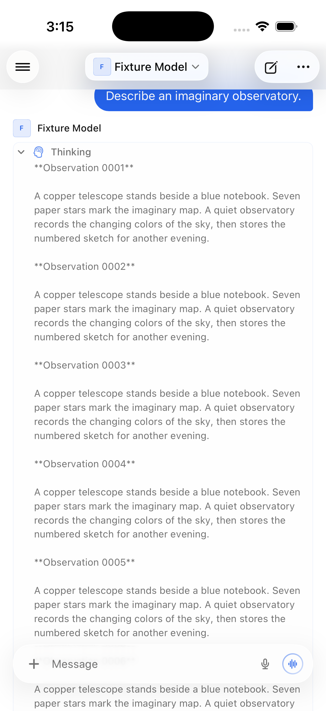
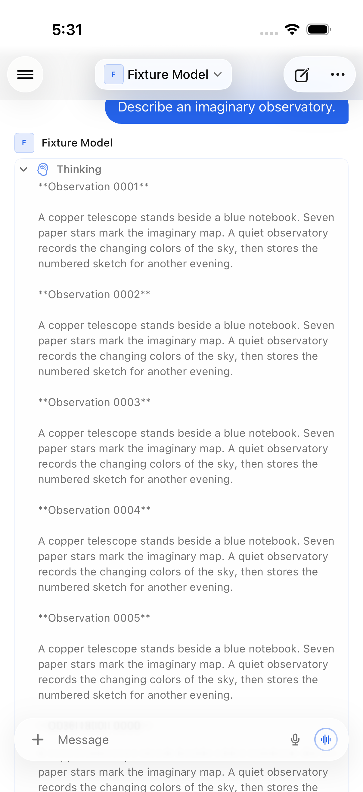

# Long-message rendering regressions

All fixtures and screenshots here are newly invented, synthetic content. The
fixture service is loopback-only and in-memory; it does not read a database or
connect to another service.

## Reasoning expansion

A single SwiftUI `Text` containing a long completed reasoning block creates a
large native layout and drawing surface when expanded. `ReasoningText` reuses
Litext's viewport-bounded drawing with the original, continuous string. It does
not split paragraphs, interpret markdown, or introduce selection boundaries.
The caller retains the existing font scale, color, line spacing and padding.
The wrapper measures against SwiftUI's proposed width before placement. Letting
an initially unwrapped label correct its height afterward can trigger the chat's
bottom-follow logic and jump away from the expanded header. Both the component
width assertion and the UI header-position assertion cover that contract.

Release iOS 26.5 simulator measurements, five component-test iterations, approximately
111,000 characters at a 12-point font:

| Measurement | SwiftUI Text | Viewport-bounded Litext |
|---|---:|---:|
| Mean CPU time per expansion | 1.204 s | 0.017 s |
| Mean elapsed time, including a fixed 100 ms settle | 1.315 s | 0.113 s |

These component measurements are simulator observations, not physical-device
FPS or universal performance guarantees. Build the baseline at
`a5c0cfa014c92b4875b7ccb2a64562205b258eb8` for full-app comparisons; the unit
benchmark retains the original `Text` path alongside the candidate.

| Before | After |
|---|---|
|  |  |

## Blank markdown after ancestor movement

The dependency revision includes
[Litext's viewport fix](https://github.com/Ichigo3766/Litext/pull/1) and
[upstream synchronization](https://github.com/Ichigo3766/Litext/pull/2), including
visible-line culling and compatibility with the existing MarkdownView consumer.
Merge the dependency PR before this app change. The fork's
bounded drawing surface previously missed an ancestor moving onscreen without a
scroll-offset or label-bounds change. Its pixel regression fails before the fix
and passes afterward, also checking resize, transform, detach, repeated movement,
and observer lifetime. See that PR for the independent minimal reproduction.

Full-app pagination remains useful coverage, not a deterministic reproduction:
an eight-minute, 100-gesture baseline run did not trigger the intermittent blank
patch. `RenderingUITests` checks actual rendered text pixels as well as progress
into older history, so accessible-but-blank text cannot pass as rendered content.

## Run

The four component tests pass on iOS 18.4 and iOS 26.5. The three fixture-server
unit tests also pass. The pinned renderer's independent viewport/compatibility
suite has 16 passing tests on each simulator runtime.

The final Release app passes the single-paragraph round trip on iOS 18.4 (23 fast
swipes each way), and all four remaining UI tests on iOS 26.5: chat switching,
the multi-paragraph round trip (42 fast swipes each way), long-press selection,
and 100 pagination drags with rendered-pixel checks. The iOS 26 suite ran for
approximately 13 minutes; the separate iOS 18 run took approximately 3 minutes.

```sh
python3 -m unittest discover -s Tests/ReasoningRendering -p 'test_*.py'
python3 Tests/ReasoningRendering/rendering_server.py
```

Use a disposable simulator and connect Open Relay to `http://127.0.0.1:18188`.
Sign in with `demo@example.test` / `synthetic`. Never run this harness against a
real account. Install the Release app build to be tested before UI automation.
The UI pixel checks use a portrait iPhone viewport.

```sh
xcodegen generate --spec Tests/ReasoningRendering/project.yml
xcodebuild test \
  -project Tests/ReasoningRendering/ReasoningRendering.xcodeproj \
  -scheme ReasoningRendering -configuration Release \
  -destination 'platform=iOS Simulator,id=<disposable-simulator-id>'
xcodebuild test \
  -project Tests/ReasoningRendering/ReasoningRendering.xcodeproj \
  -scheme RenderingUI -configuration Release \
  -destination 'platform=iOS Simulator,id=<disposable-simulator-id>'
```

The UI suite scrolls long completed reasoning and a long single paragraph to the
final answer and back, collapses reasoning, switches chats, checks literal
Unicode/markup content and long-press selection, and scrolls a 513-message history.
It uses fast flicks for long reasoning and 100 slower history drags. Allow several
minutes.
The component suite checks literal content and updates for empty, short,
whitespace-only, multiline, unbroken, and multi-scalar Unicode strings; font,
color and width changes; whole-text selection; bounded drawing surfaces; and
actual rendered pixels at the top, middle and bottom of long reasoning.
