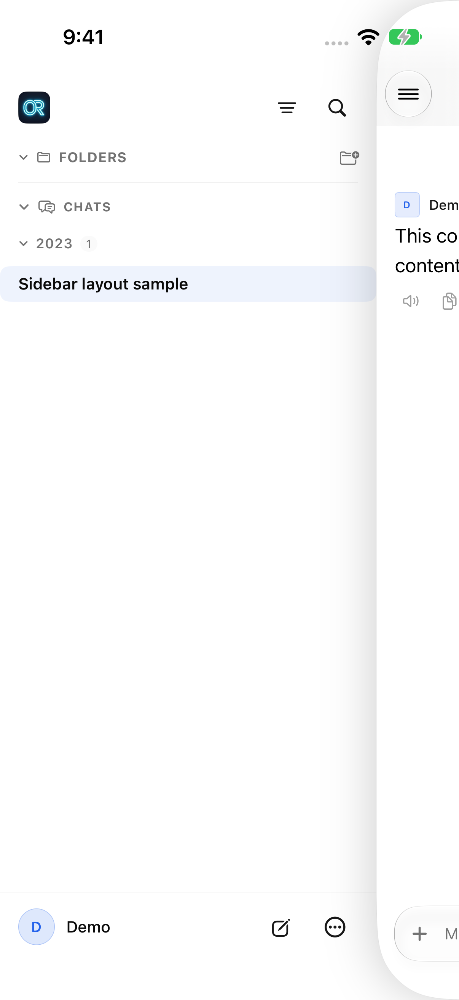
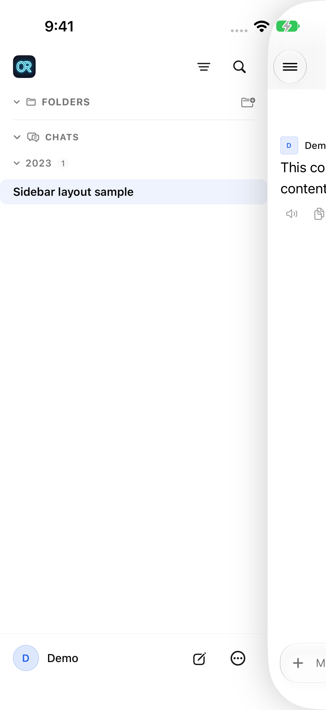
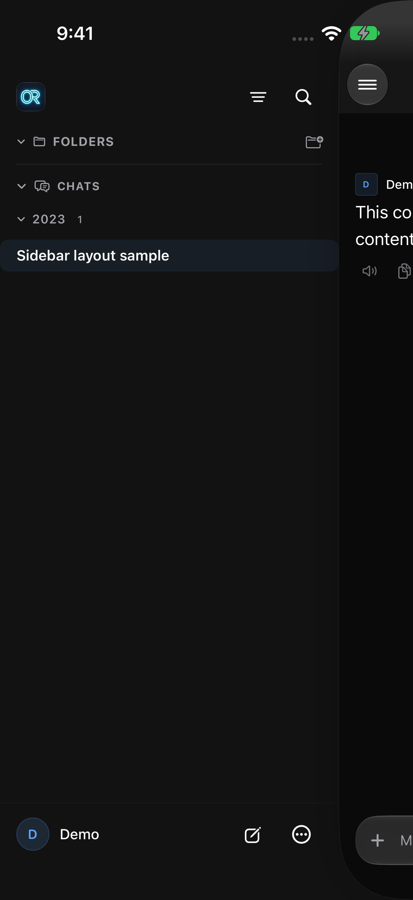
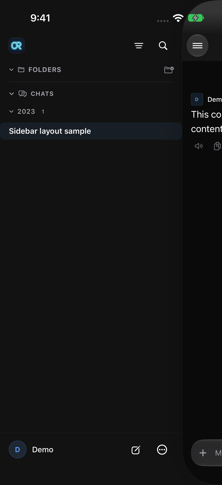

# Sidebar header alignment

Synthetic-only UI regression test for the sidebar's server icon, filter, and
search button. No production server or account is needed.

## Reproduce

1. Build/install Open Relay in a disposable iPhone simulator.
2. In an isolated Python environment, install `aiohttp` and `python-socketio`,
   then run `python -B Tests/SidebarHeader/fixture.py` from the repository root.
3. Connect the simulator app to `http://127.0.0.1:18191` and sign in with
   `demo@example.test` and any synthetic password. The fixture ignores login
   values and supplies a fixed demo account and conversation. Never use real credentials.
4. Generate the standalone UI-test project with XcodeGen. Keep generated files,
   build products, and result bundles outside the repository:

   ```sh
   # Set QA_DIR to an existing scratch directory and DEVICE_ID to the simulator.
   ln -s "$PWD/Tests/SidebarHeader/SidebarHeaderUITests.swift" "$QA_DIR/SidebarHeaderUITests.swift"
   xcodegen generate --spec Tests/SidebarHeader/project.yml --project "$QA_DIR"
   xcodebuild -project "$QA_DIR/SidebarHeaderTests.xcodeproj" \
     -scheme SidebarHeader -destination "platform=iOS Simulator,id=$DEVICE_ID" \
     -derivedDataPath "$QA_DIR/Build" -parallel-testing-enabled NO \
     -resultBundlePath "$QA_DIR/Light.xcresult" test
   ```

5. Repeat in dark appearance with a new result-bundle path.

The test compares actual accessibility-frame centers, not source constants. It
also opens/closes the drawer repeatedly, exercises its filter/search controls,
and checks alignment from a new chat. Screenshots are attached to the test result.

## Cause

The sidebar's 36-point controls had 14 points of top padding, placing their
centers 32 points below the safe-area top. The chat's 40-point controls have no
top padding, placing their centers 20 points below it. Giving the sidebar a
40-point row and the same 8-point bottom spacing aligns the two headers without
changing button sizes, horizontal positions, or drawer animation.

## Verified results

Baseline: Open Relay 5.9, `f5b8ce858cd790718a31107d954e6cfe32704bb2`.
Tested with Xcode 27.0 on an iPhone 16 Pro simulator running iOS 27.0.
Release simulator build passed. The UI test fails on the baseline alignment
assertion and passes with the fix in both appearances, including all interaction
checks described above.

| Appearance | Chat control center Y | Sidebar center before | Sidebar center after |
| --- | ---: | ---: | ---: |
| Light | 82 pt | 94 pt | 82 pt |
| Dark | 82 pt | 94 pt | 82 pt |

Coordinates are screen points on this simulator; the test compares the two
headers directly rather than requiring a particular safe-area height.

| Appearance | Before | After |
| --- | --- | --- |
| Light |  |  |
| Dark |  |  |

## Privacy

All test text, account details, and identifiers are freshly invented. The fixture
serves the repository's public app icon. Published screenshots contain only this
fixture, have been visually reviewed, and exclude textual/EXIF metadata. No raw
device logs, result bundles, private configuration, or personal chats are included.
