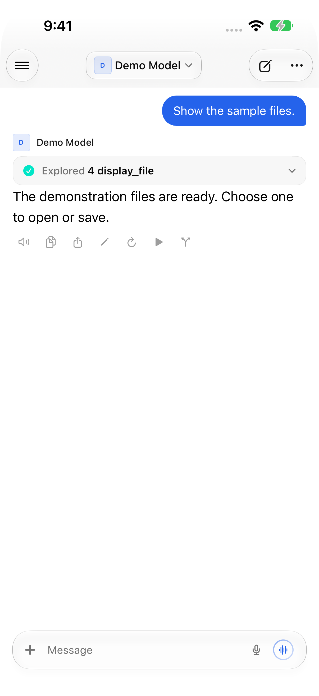
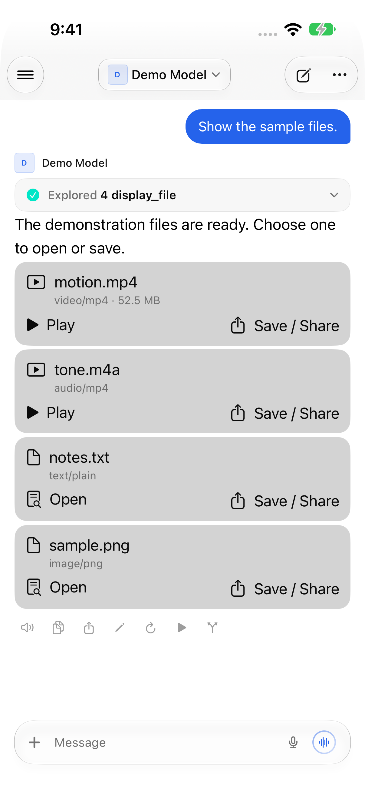

# On-demand terminal attachments

## Contract and implementation

Baseline: Open Relay 5.9, `f5b8ce858cd790718a31107d954e6cfe32704bb2`.
Native contract reviewed at Open WebUI `8bd8b4fac5e059578ac0c74b3c18d11139f88b7d`:
[structured output](https://github.com/open-webui/open-webui/blob/8bd8b4fac5e059578ac0c74b3c18d11139f88b7d/src/lib/components/chat/Messages/structuredOutput.ts),
[terminal events](https://github.com/open-webui/open-webui/blob/8bd8b4fac5e059578ac0c74b3c18d11139f88b7d/backend/open_webui/utils/middleware.py),
[authenticated proxy](https://github.com/open-webui/open-webui/blob/8bd8b4fac5e059578ac0c74b3c18d11139f88b7d/backend/open_webui/routers/terminals.py).

- Completed `display_file` structured results produce metadata-only cards. The
  original tool result remains inspectable. `displayed` is optional.
- Live `terminal:display_file` events produce the same cards. Path-only events
  use the terminal captured for the originating request, not a later selection.
  Saved results and live events merge by terminal, session, and path.
- Play, Open, and Save / Share are the only download triggers. Scrolling,
  expanding a tool, and appearing/remounting a view do not prepare a player,
  request a thumbnail, or fetch file contents.
- Requests use the existing authenticated server request builder and terminal
  proxy, with `X-Session-Id`. No direct terminal address or public URL is used.
- Downloads go to disk with cancellation, byte-count progress, and retry.
  There is a 256 MiB per-file limit, two-transfer limit, and 512 MiB LRU cache
  with ten-minute reuse. Cache keys include connection/account scope, message,
  terminal, session, and path. Active viewers retain ownership through eviction.
  Partial downloads are removed; redirects are rejected.
- Quick Look provides native media/document viewing; the system share sheet
  provides Save to Files and other export destinations. No new media dependency.

### Streaming and preview limits

Source review of Open WebUI's terminal proxy found that it does **not** forward
`Range`/`If-Range` to the terminal and strips `Content-Length`. Therefore this
client downloads the selected file completely to disk **after** the action,
then opens it. It does not claim progressive playback. The fixture reproduces
chunked transfer without `Content-Length`; no production server was benchmarked.

Video/audio codecs and document formats depend on the platform's Quick Look
support. MP4/H.264/AAC, M4A/AAC, plain text, and PNG are exercised here. Other
formats still have Save / Share; PDF/Office support follows Quick Look and is
not independently verified by these tests. File page hints are not applied.
Inline and sidebar-intended results remain discoverable as dormant chat cards
on iPhone; events never automatically open a viewer or download a file.
Bare cross-client events without terminal identity wait for structured history
rather than guessing a terminal. Full descriptors work across clients.
References must identify a server-managed terminal; URL-only terminal selectors
are not treated as phone-accessible URLs.

## Synthetic verification

The fixture uses freshly generated color bars, a sine tone, a blue image, and
invented chat/document text. No real chats, media, credentials, server settings,
logs, or screenshots are used. The fixture counts **terminal-file-content
requests and bytes**, not just playback state. Ordinary chat metadata and the
pre-existing inline image API are separate from this counter.

| Check | Result / measurement |
| --- | --- |
| Released baseline opens saved structured result | Tool metadata only; attachment Play action absent |
| Candidate opens, scrolls four times, expands tool details, restarts/reopens twice | **0 content requests; 0 bytes** |
| Parse/reconstruct saved output 200 times | **0 content requests; 0 bytes** |
| Explicit Play | One selected MP4 request; **53,116,612 bytes** written to disk; SHA-256 equals fixture original |
| Open another attachment | Only the selected file is requested; unopened audio/image untouched |
| Cached repeat open | No second request for the same scoped identity |
| Live event, repeated event, saved snapshot | One attachment card; **0 requests before Open** |
| Path-only event from the originating request, before response text | Card visible while generation is active; **0 content requests** |
| Missing/disconnected/denied files | Recoverable HTTP 404/503/403 errors |
| Incorrect session / changed account | Rejected; no transcript/chat/session substitution |
| Duplicate request, cancelled slow download, retry after HTTP 500 | No parallel duplicate; transfer stops before completion; retry succeeds |
| Oversized advertised response | Aborted after 65,536 received fixture bytes, well below the full file |
| Redirect | Rejected; redirect target receives no request |
| Video fullscreen, advancing playback, pause/resume, seek, dismiss/reopen | XCUITest + visual inspection |
| Audio playback, image/text preview, native export | XCUITest + visual inspection |
| Ordinary tool inspection, image, rich HTML embed | XCUITest + visual inspection; existing rendering unchanged |

Validation passed: **47 focused checks and 9 full-app UI tests**.
The focused Swift suite compiles the production parser, history reconstruction,
metadata, downloader, and cache with only the API request-builder context
substituted. UI tests drive the real app on an iPhone simulator running iOS 27.
The app's Release simulator build succeeds. This is not a physical-device or
real-provider reliability benchmark.

## Reproduce

Requirements: Xcode, Python 3 with `aiohttp` and `python-socketio`, `ffmpeg` with
libx264, and XcodeGen for UI tests. Use a disposable **synthetic-only** simulator.
Choose an artifact directory outside the checkout with room for generated media
and build results. Do not point these scripts at user media or an existing server.

```sh
FILE_QA_DIR=/path/to/disposable/file-qa
python3 -B Tests/TerminalFiles/generate.py "$FILE_QA_DIR"
python3 -B Tests/TerminalFiles/fixture.py --files "$FILE_QA_DIR"
```

In another terminal, run the native checks (do not run concurrently with the UI
suite: both deliberately reset fixture counters):

```sh
python3 -B Tests/TerminalFiles/test.py --work "$FILE_QA_DIR"
```

Install the app's simulator build. Connect it to `http://127.0.0.1:18191` using
the fixture-only API token `synthetic-token`. The optional `test01Connect` helper
can configure the initial connection. To generate/run the standalone UI target:

```sh
mkdir -p "$FILE_QA_DIR/UITests"
ln -s "$PWD/Tests/TerminalFiles/TerminalFilesUITests.swift" "$FILE_QA_DIR/UITests/TerminalFilesUITests.swift"
xcodegen generate --spec Tests/TerminalFiles/project.yml --project "$FILE_QA_DIR/UITests"
xcodebuild -project "$FILE_QA_DIR/UITests/TerminalFilesTests.xcodeproj" \
  -scheme TerminalFiles -destination 'platform=iOS Simulator,id=YOUR_SYNTHETIC_DEVICE_ID' \
  -derivedDataPath "$FILE_QA_DIR/DerivedData" -parallel-testing-enabled NO \
  -collect-test-diagnostics never -resultBundlePath "$FILE_QA_DIR/Results.xcresult" test
```

`/fixture/metrics` reports per-file requests, bytes, and rejected requests.
Generated media, build products, and raw test bundles must remain outside Git.

## Reviewed synthetic screenshots

These are actual simulator captures, not mockups. PNG text/EXIF metadata was
removed with `export_screenshot.py`; image pixels are unchanged.

| Released 5.9 | On-demand attachments |
| --- | --- |
|  |  |

Additional states: [loading one file](Screenshots/loading.png),
[native video playback and seeking](Screenshots/video.png),
[audio](Screenshots/audio.png), [image](Screenshots/image.png),
[document](Screenshots/document.png), [export](Screenshots/export.png),
[recoverable error](Screenshots/retry.png),
[ordinary tool, image and HTML embed](Screenshots/ordinary.png).
