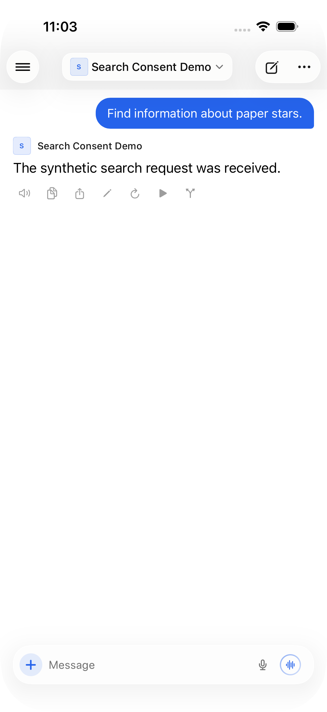
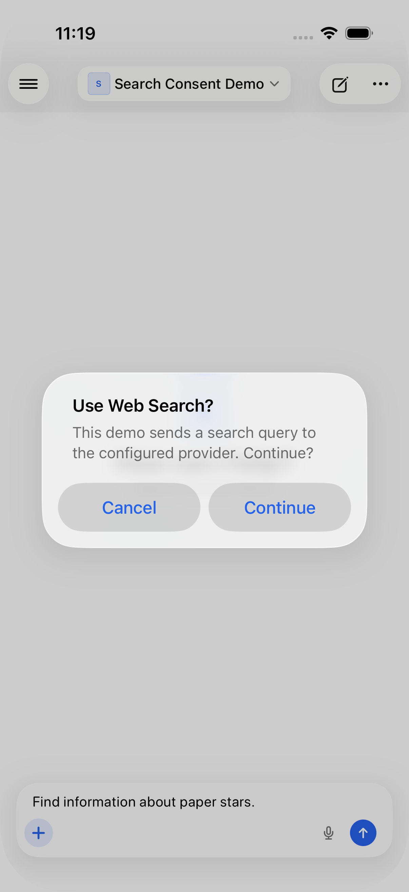
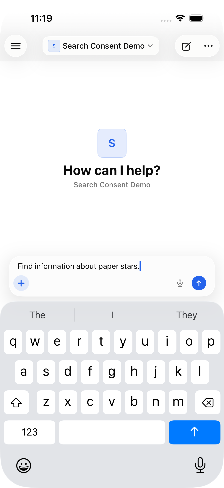

# Web search consent

Initial baseline: Open Relay 5.9 (`f5b8ce8`), Open WebUI `8bd8b4f`.
Rebased and validated on Open Relay 6.0 (`4151a73`).

`python3 Tests/WebSearchConsent/run.py` compiles the production feature decoder and
consent state against a mocked API. It checks 18 cases plus routing of send,
regenerate, continue, edit, voice-call startup, account reset, and model-refresh
cancellation. `--baseline` intentionally fails because the original decoder drops
the server's required-confirmation flag.

Consent is per chat, cached while web search remains enabled, and reset on disabling
search, starting a new chat, or changing accounts. Leaving the view cancels a pending
operation. Model defaults refresh before asking, so a newly enabled default does not
bypass consent. A config error fails closed without clearing the draft. The server's
notice is shown as text in a native alert; no HTML or JavaScript is executed.

For actual app checks, start `fixture.py` in a Python environment with `aiohttp`
and `python-socketio`, then connect an isolated simulator to `http://127.0.0.1:18191`
using `demo@example.test` / `synthetic`. Run XcodeGen with `project.yml`, install
the app build, and run the `WebSearchConsent` scheme:

- `testBefore`: the original app sends a search-enabled completion without an alert.
- `testConsent`: no chat or request exists before consent; Cancel retains the draft;
  retry and Continue send exactly one search-enabled request and show the response.
- `testDisabledPolicy`: no dialog when the server disables confirmation.

All fixture data is invented. It contacts no search provider or private server.
The UI checks cover chat consent; voice audio/provider behavior is not benchmarked.

The full Release simulator build and both fixed UI tests passed on the 6.0-based
patch. The baseline capture is from the 5.9-based app; the decoder regression also
reproduces on 6.0. All 18 focused checks pass. Only reviewed synthetic captures
are included, not test logs or simulator diagnostics.

| Before: request sent without asking | After: explicit confirmation | Cancel: draft retained |
|---|---|---|
|  |  |  |
